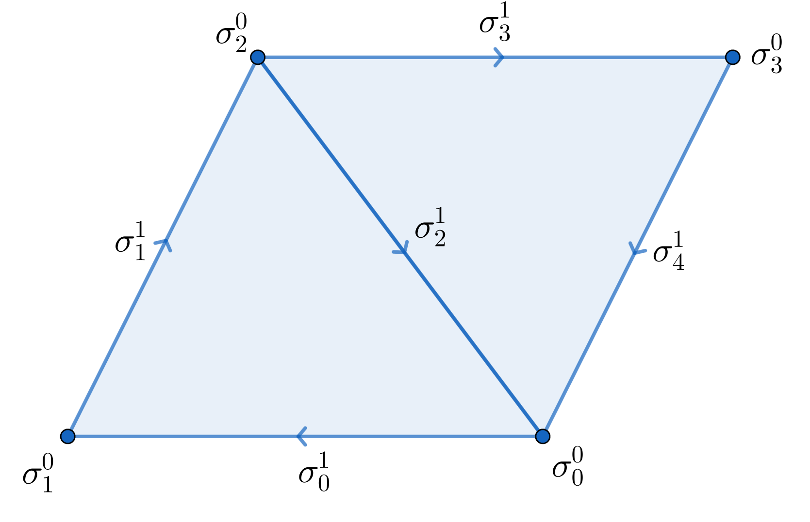
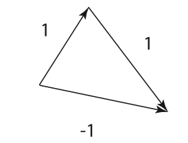

# Differential Forms

Differential forms are, in some sense, a generalization of the concept
of derivative. Referring to [@flanders1963differential], differential
forms "are the things which occur under integral signs". In this section
we review formally some well-know concepts of differential geometry, in
order to define correspondent discrete counterparts in the next section.

Let us fix some notations used in the following sections:

-   $\mathcal{E}^n$ is an $n$-dimensional euclidean space.

-   $\mathcal{V}$ is the $n$-dimensional translation space of
    $\mathcal{E}^n$ with base $\{\boldsymbol{e}_1, \dots, \boldsymbol{e}_n\}$.

-   $\langle \langle\cdot , \cdot \rangle \rangle: \mathcal{V}\times \mathcal{V}\rightarrow \mathbb{R}$
    is an inner product, i.e. a symmetric bilinear positive definite
    function.

## Exterior algebra

::: refbox
**References:** {cite}`grady2010discrete`, Section 2.2.1.1.
[@epstein2010geometrical], Chapter 3. [@crane2018discrete], Section 4.1
:::

From a geometric point of view, citing [@crane2018discrete], if linear
algebra can be thought as the natural language of "little arrows", then
exterior algebra is the natural language of "little volumes". For
instance, $1$-vectors represent lengths and $2$-vectors represent area.
They encode two basic pieces of information: direction and magnitude.

The first ingredient to define $p$-vectors is the **exterior product**
(or wedge product), which is the multiplication operation of the
*exterior algebra*. In this contest, we do not need the formal
definition of this algebra, for more details see Chapter 3 of
[@epstein2010geometrical].

Geometrically exterior product provides a way to measure the area of a
parallelogram defined by a pair of vectors or the volume of a
parallelepiped produced by a set of vectors in higher dimensions.

::: defbox
Given $\boldsymbol{v}_1, \boldsymbol{v}_2 \in \mathcal{V}$ the exterior product
$\boldsymbol{v}_1 \wedge \boldsymbol{v}_2$ is an anticommutative product on the elements
of $\mathcal{V}$ and linear in each of its argument.
:::

In components,

$$
\boldsymbol{v}_1 \wedge \boldsymbol{v}_2 = \sum_{i < j}(v_1^i v_2^j - v_1^j
v_2^i)\boldsymbol{e}_i \wedge \boldsymbol{e}_j.
$$

**Definition 1**. For $p= 0,\dots, n$ define the set of $p$**-vectors**
$\bigwedge^p \mathcal{V}$ as follows:

-   $\bigwedge^0 \mathcal{V}:= \mathbb{R}, \bigwedge^1 \mathcal{V}:= \mathcal{V}, \bigwedge^n \mathcal{V}:= \mathbb{R}$.

-   For $2 \leq p \leq n-1$, $\bigwedge^p \mathcal{V}$ is the vector
    space spanned by elements represented as
    $\boldsymbol{v}_1 \wedge \dots \wedge \boldsymbol{v}_p$, where
    $\boldsymbol{v}_i \in \mathcal{V}$.

It can be proved that the dimension of $\bigwedge^p \mathcal{V}$ is
$\binom{n}{p}$. Note that the exterior product between a $p$-vector and
a $q$-vector can be made and the result is a $(p+q)$-vector.

:::: defbox
::: Def
**Definition 2**. We define the **dual space** $\mathcal{V}^*$ of
$\mathcal{V}$ as
$$\mathcal{V}^* := \{f: \mathcal{V}\rightarrow \mathbb{R}| \text{ } f \text{ is linear}\}.$$
:::
::::

::: importantbox
It is easy to prove that $\mathcal{V}^*$ is a vector space over
$\mathbb{R}$; we will call the elements of this space **forms**. Since
exterior product is defined over a generic vector space, we have
automatically the definition of $\bigwedge^p \mathcal{V}^*$: the
elements of this set are called **$p$-forms**.
:::

## Manifolds

::: refbox
**References:** [@grady2010discrete], Section 2.2.1.2.
[@epstein2010geometrical], Section 4.6
:::

:::: defbox
::: Def
**Definition 3**. An **$m$-dimensional manifold** is a topological space
$M$ that is "locally Euclidean", in the sense that for any $x \in M$
exists $U$ neighborhood of $x$ homeomorphic to an open subset of the
Euclidean space $\mathcal{E}^m$ through $\phi$. The pairs $(U, \phi)$
are called **charts** and the collection of charts is the **atlas** of
the manifold. A **differential manifold** is a manifold whose
homeomorphisms are indeed diffeomorphisms (i.e. they are
differentiable).
:::
::::

We will focus on $n$-dimensional **submanifold** of $\mathcal{E}^{m}$,
i.e. on $n$-dimensional manifold $M \subseteq \mathcal{E}^{m}$. From now
on, we indicate it with $M^n$.

::: defbox
Since $M^n$ is locally Euclidean, we can define[^1] at each point
$x \in M^n$ the **tangent space** to $M^n$ at $x$, denoted as $T_x M^n$,
as the real vector space consisting of all tangent vectors to $M^n$ at
$x$.
:::

We can define the **tangent bundle** $T M^n$ of a submanifold $M^n$ as
the set of *all* tangent vectors of $M^n$, i.e.

$$
T M^n = \bigcup_{x \in M^n} T_x M^n.
$$

:::: defbox
::: Def
**Definition 4**. A **Riemannian manifold** $(M,g)$ is a manifold $M$
endowed with a positive-definite inner product $g_x$ on the tangent
space $T_x M$ at each point $x \in M$.
:::
::::

:::: defbox
::: Def
**Definition 5**. Given $\boldsymbol{v}\in T_x M^n$ and
$f: M^n \rightarrow \mathbb{R}$ differentiable in $x$ we can define the
**directional derivative** of $f$ at point $x$ as

$$
(D_{\boldsymbol{v}} f)(x) := \frac{d}{dt}[f(x+t\boldsymbol{v})]_{t = 0}
$$
:::
::::

If $x$ is any local Cartesian coordinate system specified by
$(x^1, \dots, x^n)$ then the directional derivative can be expressed as

$$
(D_v f)(q) = \sum_{j = 1}^n \frac{\partial f}{\partial x^j}(q) v^j,
$$

from which we discover a one-to-one correspondence between tangent
vectors and differential operators on differentiable functions near $q$.

:::: defbox
::: Def
**Definition 6**. A **scalar differential form** is a linear functional
$\omega: T_x M^n \rightarrow \mathbb{R}$, i.e. any
$\omega \in (T_x M^n)^*$. We indicate $(T_x M^n)^*$ as $T^*_x M^n$ and
we call it **cotangent space**.
:::
::::

As before, we can define the **cotangent bundle** $T^* M^n$ of a
submanifold $M^n$ as the set of *all* scalar differential form on $M^n$,
i.e. $$T^* M^n = \bigcup_{x \in M^n} T^*_x M^n.$$

:::: defbox
::: Def
**Definition 7**. Let $f: M^n \rightarrow \mathbb{R}$ be a
differentiable function, we define the **differential** of $f$ at a
point $x \in M^n$ as the linear function
$df|_x: T_x M^n \rightarrow \mathbb{R}$ defined as

$$
df(\boldsymbol{v})|_x := D_{\boldsymbol{v}}(f)(x).
$$
:::
::::

What we have done until now can be naturally extended to higher order
vectors and forms. Precisely, we can define the vector space of
$p-$tangent vectors $\bigwedge^p T_q M^n$ in the tangent space $T_q M^n$
and the dual vector space of **$\mathbf{p}$-differential forms**
$\bigwedge^p T^*_q M^n$ in $T^*_q M^n$.

## Metric Tensor and Musical Isomorphisms

::: refbox
**References:** [@grady2010discrete], Section 2.2.1.3.
[@hirani2003discrete], Section 5.2
:::

It is well-known that given $\boldsymbol{v},\boldsymbol{w}\in \mathcal{V}$ and
$\tilde{\boldsymbol{v}}, \tilde{\boldsymbol{w}} \in \mathbb{R}^n$ their representation
in components as column vectors

$$
\langle \boldsymbol{v},\boldsymbol{w}\rangle = \tilde{\boldsymbol{v}}^T \boldsymbol{G}
\tilde{\boldsymbol{w}},
$$

where a generic entry of $G$ is defined as

$$
g_{ij} := \langle \boldsymbol{e}_i, \boldsymbol{e}_j \rangle
$$

::: defbox
$\boldsymbol{G}$ is called the **metric tensor**.
:::

::: importantbox
Every vector $\boldsymbol{v}$ in the inner product space $\mathcal{V}$ can be
associated with a form $\alpha \in \mathcal{V}^*$, which is called the
**covariant version** of $\boldsymbol{v}$.

Vice versa, given a form $\alpha$ we can associate to it a vector
$\boldsymbol{v}$, which is called the **contravariant version** of $\alpha$.
:::

These relationships are the so-called **musical isomorphisms**, i.e.
flat and sharp operator. The name of these operators is borrowed from
music: as flat means "lower in pitch" in music, the flat operator lowers
the indices of a $1$-form. Similarly, as sharp means "higher in pitch"
in music, the sharp operator raises the indices of a vector field.

Let us the formal definition explicitly.

:::: defbox
::: Def
**Definition 8**. Let $M$ be a Riemannian manifold with metric
$\langle , \rangle$ and let $\alpha$ be a $1$-form on $M$. The **sharp
map** $\sharp$ from $1$-forms to vector fields is defined as

$$
\langle \boldsymbol{\alpha}^{\sharp}, \boldsymbol{u}\rangle := \alpha(\boldsymbol{u}),
$$

for
any $x \in M$ and $\boldsymbol{u}\in T_x M$
:::
::::

:::: defbox
::: Def
**Definition 9**. Let $M$ be a Riemannian manifold with metric
$\langle , \rangle$ and let $\boldsymbol{v}\in \mathcal{V}(M)$ be a vector field
on $M$. The **flat map** $\flat$ from vector fields to $1$-forms is
defined as $$v^{\flat}(\boldsymbol{u}) := \langle \boldsymbol{v},\boldsymbol{u}\rangle,$$ for
any $x \in M$ and $\boldsymbol{u}\in T_x M$.
:::
::::

Note that $\sharp$ and $\flat$ are indeed inverses of each other, as we
should expect.

## The Exterior Derivative

::: refbox
**References:** [@grady2010discrete], Section 2.2.2.1.
[@epstein2010geometrical], Section 6.3
:::

:::: defbox
::: Def
**Definition 10**. The **exterior derivative** is the unique operator
$d: \bigwedge^p (T^* M^n) \rightarrow \bigwedge^{(p+1)} (T^* M^n)$ that
satisfies the following conditions: for any
$\alpha, \beta \in \bigwedge^p (T^* M^n)$

1.  $d(\alpha + \beta) = d \alpha + d \beta$.

2.  $d(\alpha \wedge \beta) = (d\alpha) \wedge \beta + (-1)^p \alpha \wedge d\beta$
    (Leibniz's chain rule).

3.  $d(d\alpha) = 0$.

4.  $df$ is the differential of $f$ for any differentiable $0$-form
    (i.e. scalar function) $f$.

A derivative with property 2. is called an **antiderivation**.
:::
::::

::: importantbox
Example 2.2 and Example 2.3 of [@grady2010discrete] show how exterior
derivative is linked with the curl of a scalar field and the divergence
of a vector field.
:::

It is important to stress the difference between $df$ and $\nabla f$:
although there is clearly a link between them, the former is a
*covariant* quantity, whereas the latter is a *contravariant* quantity.
To highlight their connection, we need a metric tensor, from which we
obtain $$df(\boldsymbol{v}) = \langle \langle\nabla f, \boldsymbol{v}\rangle \rangle.$$

:::: defbox
::: Def
**Definition 11**. A form $\omega$ is **closed** if $d \omega = 0$.

A form $\alpha$ is **exact** if exists a form $\beta$ such that
$d \beta = \alpha$.
:::
::::

## Integration of Differential Forms in Manifolds

### The Pull-back of a Form

::: refbox
**References:** [@epstein2010geometrical], Section 4.13.
[@frankel2011geometry], Section 2.3b and Section 2.7
:::

Let $F: M \rightarrow N$ be a smooth map between manifolds $M$ and $N$
of dimension respectively $m$ and $n$. We start defining the pull-back
for smooth functions (i.e. differential $0$-forms).

:::: defbox
::: Def
**Definition 12**. Let $\phi: M  \rightarrow \mathbb{R}$ be a smooth
function. We define its **pull-back** as the map
$F^*\phi : M \rightarrow \mathbb{R}$ defined as
$$F^*\phi = \phi \circ F$$
:::
::::

:::: defbox
::: Def
**Definition 13**. Let $\omega$ be a $p$-form on $N$. The **pull-back**
of $\omega$ is the $p$-form $F^* \omega$ on $M$ defined as
$$F^* \omega(\boldsymbol{v}_1, \dots, \boldsymbol{v}_p) := \omega(dF(\boldsymbol{v}_1), \dots, dF(\boldsymbol{v}_p)),$$
where $\boldsymbol{v}_i$ is a vector field on $M$ for every $i$.
:::
::::

:::: importantbox
::: Th
**Theorem 14** (Calculus rules). *Let $\alpha$ and $\beta$ be
respectively a $p$-form and a $q$-form in $N$.*

-   *$F^* (\alpha \wedge \beta) = F^* \alpha \wedge F^*\beta$.*

-   *$F* d \alpha = d F^* \alpha$.*
:::
::::

### Integration

::: refbox
**References:** [@flanders1963differential], Section 5.5-5.7.
[@epstein2010geometrical], Chapter 6. [@frankel2011geometry], Chapter 3
:::

In this section, we want to define $$\int_{\sigma^p} \omega,$$ where
$\omega$ is a $p$-form and $\sigma^p$ is a $p$-simplex in a
$n$-dimensional manifold $M$. We proceed step by step.

:::: defbox
::: Def
**Definition 15**. We define the **standard $n$-simplex** $\Delta^n$ in
$\mathbb{R}^n$ as the simplex generated by $p_0 = 0$ and
$$p_i = (0, \dots, \underbrace{1}_\text{i}, \dots, 0),$$ where
$i \in \{1, \dots, n\}$.
:::
::::

The first step is to define the integral of an $n$-form in the standard
$n$-simplex.

:::: defbox
::: Def
**Definition 16**. Let $\omega$ be an $n$-form defined on a domain
$U \subset \mathbb{R}^n$ which includes $\Delta^n$, i.e.
$\Delta^n \subset U$. We can write
$\omega(x) = f(x^1, \dots, x^n) dx^1 \cdots dx^n$ and we define
$$\int_{\Delta^n} \omega := \int_{\Delta^n} f(x^1, \dots, x^n) dx^1 \cdots dx^n,$$
where the right hand side is the **standard Riemann integral** of the
continuous function $f$.
:::
::::

**Example 17**. For example, if $$\omega = dzdydx$$ then
$$\int_{\Delta^3} \omega = -\int_{\Delta^3} dzdydx = - \int^1_0 dy \int_{0}^{1-y} dx \int_{0}^{1-x-y}dz = -\frac{1}{6}.$$

Then, finally:

:::: defbox
::: Def
**Definition 18**. Let $\omega$ be a $p$-form on $M$ and let $\sigma^p$
be a $p$-simplex in $M$, *i.e.* there exists a smooth mapping $\phi$ of
a neighborhood of $\Delta^p$ into $M$ such that
$\sigma^p = \phi(\Delta^p)$. We define
$$\int_{\sigma^p} \omega := \int_{\Delta^p} \phi^* \omega.$$
:::
::::

The integral of a $p$-form over a $p$-chain on a manifold is then
extended by linearity.

::: Ex
**Example 19**. **Line integrals**. Consider a curve
$\gamma: \boldsymbol{x}= F(t)$, where $a \leq t \leq b$, in $\mathcal{E}^3$,
oriented such that $d/dt$ defines the positive orientation in
$\mathbb{R}$. If
$\omega = \omega_1(x) dx^1 + \omega_2(x) dx^2 + \omega_3(x) dx^3$ is a
$1$-form on $\mathcal{E}^3$, then
$$\int_\gamma \omega = \int_\gamma \sum_i a_i(x)dx^i = \int^b_a F^*\left[ \sum_i a_i(x) dx^i\right] = \int_a^b \left[ \sum_i a_i(x(t)) \frac{dx^i}{dt} \right] dt,$$
which is exactly the usual rule for evaluating a line integral!
:::

We have defined the integral of a $p$-form $\omega$ over a $p$-simplex
in a manifold $M$, however it is possible to define more in general what
is $$\int_M \omega,$$

when $M$ is an oriented manifold (see e.g. Section 6.3 in
[@epstein2010geometrical]).

The most important result regarding the integral of a differential form
is the following

:::: importantbox
::: Th
**Theorem 20** (Generalized Stokes). *Let $S$ be a $p$-dimensional
oriented submanifold of $M$, let $\partial S$ be its boundary with
induced orientation. Let $\omega$ be a differential $p$-form in the
cotangent bundle $T^* M$, then it holds
$$\int_S d \omega = \int_{\partial S} \omega.$$*
:::
::::

::: importantbox
The boundary of the boundary is always zero, hence for Generalized
Stokes the exterior derivative of an exterior derivative is always zero.
:::

## The Hodge Star Operator

::: refbox
**References:** [@grady2010discrete], Section 2.2.3
:::

The Hodge star operator $\star$ is a linear mapping from $p$-forms to
$(n - p)$-forms that requires a metric tensor and an orientation on the
underlying manifold. It provides a scalar product between forms, and is
necessary to complete the correspondence between standard vector
calculus and the exterior calculus of differential forms.

:::: defbox
::: Def
**Definition 21**. The **Hodge star operator**
$\star: \bigwedge^p \mathcal{V}^* \rightarrow \bigwedge^{n-p} \mathcal{V}^*$
is a linear mapping (actually an isomorphism) from $p$-forms to
$(n-p)$-forms defined as follows: given an elementary $p$-form
$\sigma^{i_1} \wedge \dots \wedge \sigma^{i_p}$
$$\star(\sigma^{i_1} \wedge \dots \wedge \sigma^{i_p}) = \sigma^{i_{p+1}} \wedge \dots \wedge \sigma^{i_n}.$$
The $(n-p)$-form $\star \omega$ is said to be the **Hodge dual** of the
$p$-form $\omega$.
:::
::::

::: importantbox
The Hodge star operator has the following properties, given two
$p$-forms $\alpha$ and $\beta$ and a scalar function $f$.

-   $\star \alpha \wedge \beta = \star \beta \wedge \alpha$.

-   $\star(f\alpha) = f\star\alpha$.

-   $\star (\star \alpha) = (-1)^{p(n-p)} \alpha$.

-   $\star \star \star \star \alpha = \alpha$.

-   $\alpha \wedge \star \alpha = 0$ if and only if $\alpha = 0$.

Using these properties we obtain
$$\alpha \wedge \star \beta = \langle \boldsymbol{\alpha}, \boldsymbol{\beta}\rangle \text{vol}^n,$$
where $\boldsymbol{\alpha},\boldsymbol{\beta}$ are respectively the vector of
coefficients of $\alpha,\beta$ and
$$\text{vol}^n = \sqrt{\text{det}(\boldsymbol{G})}dx^1 \wedge \dots \wedge dx^n.$$
:::

Through the Hodge star operator, we can define a *global scalar products
of two forms* in a compact manifold $M$ as
$$(\alpha, \beta) := \int_M \alpha \wedge \star \beta = \int_M \langle \boldsymbol{\alpha}, \boldsymbol{\beta}\rangle \text{vol}^n.$$

Analogously we can define Hodge star operator between $p$-vectors and
$(n-p)$-vectors. It is important to visualize the Hodge star in
$\mathbb{R}^2$ of $1$-vectors (see next figure), to understand properly
the action of $\star$.

{width="3.5cm" height="3cm"}

::: importantbox
For a $1$-form $\boldsymbol{\alpha}$ in $\mathbb{R}^3$
$$\star d \alpha \Leftrightarrow \text{curl}(\boldsymbol{\alpha}), \quad \star d\star\alpha \Leftrightarrow \text{div}(\boldsymbol{\alpha})$$
:::

## Laplace-de Rham Operator

::: refbox
**References:** [@grady2010discrete], Section 2.2.3.1
:::

We have already seen that the exterior derivative operator maps
$p$-forms to $(p+1)$-forms. The **codifferential operator** does exactly
the opposite.

:::: defbox
::: Def
**Definition 22**. The **codifferential operator**
$d^*: \bigwedge^p (T^* M^n) \rightarrow \bigwedge^{p-1} (T^* M^n)$ is
defined as $$d^* := (-1)^{n(p+1)+1}\star d \,\star$$
:::
::::

$d^*$ is the adjoint of the exterior derivative $d$ with respect to the
global scalar product defined previously, precisely
$$(d\alpha, \beta) = (\alpha, d^*\beta).$$

:::: defbox
::: Def
**Definition 23**. The **Laplace-de Rahm operator**
$\Delta:\bigwedge^p (T^* M^n) \rightarrow \bigwedge^p (T^* M^n)$ is
defined as $$\Delta := d\,d^* + d^*\,d$$
:::
::::

Note that the Laplace-de Rham operator is self adjoint and is the
extension of the standard Laplacian up to a sign, i.e. if $f$ is a
$0$-form then $$\Delta f = - \nabla^2 f.$$

## Vector Bundles and Vector-Valued Differential Forms

Schema per scrivere sta parte:

-   Covariant differentiation

-   Bundle-valued forms

[Intro alla sezione?]{style="color: red"}

### Vector Bundles

::: refbox
**References:** [@darling1994differential], Chapter 6
:::

[Aggiustare]{style="color: red"}

Hence, another question arises: what is the exterior derivative of a
vector-valued differential forms? More in general, how it is defined a
vector-valued differential form?

In the differential framework, the generalization of differential forms
are *vector bundle differential forms*, whose are differential forms
with values in some vector bundle $E$ of a smooth manifold $M$. A
*vector-valued differential form* is then a differential forms with
values in the trivial bundle $M \times V$.

In the general case, i.e. for vector-bundle differential forms, one
defines the concepts of *connection* $\nabla$, *parallel transport* and
finally *exterior covariant derivative* $d_{\nabla}$, which is the
natural counterpart of the exterior derivative for differential forms.

[Appena possibile aggiungere commenti tra le
definizioni]{style="color: red"}

:::: defbox
::: Def
**Definition 24**. Let $M$ be a differential manifold and let
$\mathcal{V}$ be a $k$-dimensional vector space. The product manifold
$M \times V$ together with the projection map
$\pi: M \times V \rightarrow M$ such that $\pi(p, \boldsymbol{v}) = p$ is a
**local vector bundle of rank $k$** (or **trivial bundle of rank $k$**)
over $M$.
:::
::::

:::: defbox
::: Def
**Definition 25**. Let $E = M \times \mathcal{V}$ and
$E' = N \times \mathcal{W}$ be respectively a trivial bundle of rank $k$
over $M$ and of rank $q$ over $N$. A $C^r$ map $\Phi: E \rightarrow E'$
is a **(local) vector bundle morphism** if exists a map
$\varphi: M \rightarrow N$ such that
$$\Phi(p,\boldsymbol{v}) = (\varphi(p), g(p)\boldsymbol{v}) \in N \times \mathcal{W},$$
where $g(p) \in \text{Lin}(\mathcal{V}, \mathcal{W})$ for any $p$.
:::
::::

Simply, a local vector bundle morphism is a map which is "linear on the
fibers".

:::: defbox
::: Def
**Definition 26**. Let $E = M \times \mathcal{V}$ and
$E' = M \times \mathcal{W}$ be trivial bundles over $M$. The
**homeomorphism bundle** $\text{Hom}(E, E')$ is the trivial bundle
$M \times \text{Lin}(\mathcal{V}, \mathcal{W})$.
:::
::::

:::: defbox
::: Def
**Definition 27**. Let $M$ be a differential manifold. A manifold $E$
together with a smooth surjective map $\pi: E \rightarrow M$ (called
**projection**) is a $C^r$ **vector bundle of rank $k$ over $M$** if the
following three conditions hold:

-   There exists a $k$-dimensional vector space $\mathcal{V}$ such that,
    for every $p \in M$, $E_p := \pi^{-1}(p)$ is a real vector space
    isomorphic to $\mathcal{V}$. $E_p$ is called the **fiber** over $p$.

-   Each point in $M$ is contained in some open set $U \subseteq M$ such
    that there is a $C^r$ diffeomorphism
    $$\Phi_U: \pi^{-1}(U) \rightarrow U \times V \label{loctriv}$$ such
    that $\Phi_U(E_p) = \{p\} \times V$.

-   For any two open sets $U, U'$ with $U \cap U' \neq \emptyset$, the
    map
    $$\Phi_U \circ \Phi^{-1}_{U'}: (U \cap U') \times V \rightarrow (U \cap U') \times V$$
    is a $C^r$ local vector bundle isomorphism over identity.
:::
::::

[Aggiungere commenti su vector bundles]{style="color: red"}

{width="8cm" height="5cm"}

:::: defbox
::: Def
**Definition 28**. A $C^s$ **section** of a $C^r$ vector bundle
$\pi: E \rightarrow M$, where $s \leq r$, is a $C^s$ mapping
$\sigma: M \rightarrow E$ such that $\pi \circ \sigma(p) = p, p \in M$.
In other words, $\sigma(p) \in E_p$ for all $p \in M$.
:::
::::

{width="8cm" height="5cm"}

All the constructions with trivial bundles are valid for any $C^r$
vector bundle: see 6.4.3 of [@darling1994differential].

### Connections on Vector Bundles

::: refbox
**References:** [@darling1994differential], Chapter 9
:::

Let $\pi: E \rightarrow M$ be a smooth rank-$m$ vector bundle and
$\sigma: M \rightarrow E$ be a section. In terms of a local frame field
$\{s_1, \dots, s_m\}$, we can write
$$\sigma(r) = \sum_i \sigma^i(r) s_i(r) \in E_p,$$ where $\sigma^i$ is a
smooth function in some open set of $M$ for any $i$. Given a vector
field $\boldsymbol{v}$ on $M$, we want to define what it means to "differentiate
a section $\sigma$ with respect to $\boldsymbol{v}$". In other terms, we would
like to have a new section $\nabla_{\boldsymbol{v}} \sigma$ which satisfy for
all smooth functions $h \in C^{\infty}(M)$ the Leibniz rule, i.e.
$$\nabla_{\boldsymbol{v}}(h \sigma) = h(\nabla_{\boldsymbol{v}}\sigma) + (\boldsymbol{v}h)\sigma$$
and satisfying $$\begin{aligned}
    &\nabla_{h \boldsymbol{v}} \sigma = h (\nabla_{\boldsymbol{v}} \sigma),\\
    &\nabla_{\boldsymbol{v}_1 + \boldsymbol{v}_2} \sigma = \nabla_{\boldsymbol{v}_1} \sigma + \nabla_{\boldsymbol{v}_2} \sigma,\\
    &\nabla_{\boldsymbol{v}}(\sigma_1 + \sigma_2) = \nabla_{\boldsymbol{v}} \sigma_1 + \nabla_{\boldsymbol{v}} \sigma_2.
\end{aligned}$$

:::: defbox
::: Def
**Definition 29**. An operation $\nabla$ satisfying the previous
properties is called a **Koszul connetion** (or simply **connection**)
on $E$ and $\nabla_{\boldsymbol{v}} \sigma$ is called the **covariant
derivative** of $\sigma$ along $\boldsymbol{v}$.
:::
::::

:::: defbox
::: Def
**Definition 30**. Let $\pi: E \rightarrow M$ be a vector bundle of rank
$m$ over an $n$-dimensional manifold $M$, let $1 \leq q \leq n$. An
**$E$-valued $q$-form** is a section of the vector bundle
$\text{Hom}(\Lambda^q TM, E)$. By definition, the sections of
$\pi: E \rightarrow M$ will be called **$E$-valued $0$-forms**. The set
of $E$-valued $q$-forms is denoted by $\Lambda^q(M, E)$.
:::
::::

If $E$ is the trivial bundle $M \times \mathcal{V}$ the set
$\Lambda^q(M, E)$ (which is usually abbreviated with
$\Lambda^q(M, \mathcal{V})$) can be identified, once a base of
$\mathcal{V}$ is fixed, with a set of $m$-tuples
$(\omega_1, \dots, \omega_m)$ of scalar-valued $q$-forms on $M$.
[continua da qui]{style="color: red"}

# Discrete Calculus

::: refbox
**References:** [@grady2010discrete]. [@hirani2003discrete].
[@grinspun2006discrete]
:::

After having introduced the basics of exterior calculus, in this section
we focus on its discrete counterpart. The goal is translating
appropriately the tools introduced before in a continuous setting.

## Discrete Domains

::: refbox
**References:** [@grady2010discrete], Section 2.3.1.
[@hirani2003discrete], Section 2.1, 2.3. [@grinspun2006discrete]
:::

:::: defbox
::: Def
**Definition 31**. A **$p$-cell** $\sigma^p$ is defined as a set of
points which is homeomorphic to a closed unit $p$-ball
$B_p := \{x \in \mathbb{R}^p | ||x|| \leq 1\}$. The boundary of the
$p$-cell $\partial \sigma^p$ is the portion of the cell which is mapped
through the homeomorphism to $\partial B_p$.

When a $p$-cell consists of exactly $p+1$ vertices it is called
**$p$-simplex**.
:::
::::

:::: defbox
::: Def
**Definition 32**. A collection of cells defines a **cell complex** if
it satisfies the following rules:

-   The boundary of each $p$-cell (for $p > 0$) comprises the union of
    lower-order $p$-cells.

-   The intersection of any two cells is either empty or a boundary
    element of both cells.
:::
::::

This definition is exactly the concept of discrete manifold in
[@grinspun2006discrete] (see p. 43, Section 3.1.5). In
[@hirani2003discrete] cell complexes defined according to the previous
statement are called *manifold-like cell complex*. Hence, we can think
that a cell complex is the discrete counterpart of a manifold, in the
sense that in discrete calculus it plays the role of a manifold in
classical exterior calculus.

A **simplicial complex** is a cell complex in which every $p$-cell is a
$p$-simplex.

{width="8cm"
height="5cm"}

We now introduce some operative definitions that we are going to use in
the following sections.

:::: defbox
::: Def
**Definition 33**. A **well-centered simplicial complex** is a
simplicial cell-complex where the circumcenter of any $p$-simplex of the
complex lies in its interior.
:::
::::

:::: defbox
::: Def
**Definition 34**. A **flat** simplicial complex $K$ of dimension $n$ in
$\mathbb{R}^N$ is one of which all simplices are in the same affine
$n$-subspace of $\mathbb{R}^N$.
:::
::::

We will require that each $p$-cell is oriented and the orientation is
specified by the order of nodes used to represent the $p$-cell. See p.
42-44 of [@grady2010discrete] for more details in this regard.

::: importantbox
We also introduce the following notation for $p$-simplices:
$\sigma^q \prec \sigma^p$ if and only if $\sigma^q$ is a proper face of
$\sigma^p$.
:::

:::: defbox
::: Def
**Definition 35**. The **incidence matrix** $\sf{A}_p$ is the matrix
which encodes which $p$-cells are incident to which $(p-1)$-cells in the
$n$-complex and it is defined as $$\sf{A}_p(i,j) = \begin{cases}
                0 \quad \text{if } \sigma^{p-1}_i \text{ is not on the boundary of } \sigma_j^p,\\
                +1 \quad \text{if } \sigma^{p-1}_i \text{ is coherent with the induced orientation of } \sigma^p_j,\\
                -1 \quad \text{if } \sigma^{p-1}_i \text{ is not coherent with the induced orientation of } \sigma^p_j.\\
        \end{cases}$$
:::
::::

::: Ex
**Example 36**. Let us see an explicit example to understand better the
previous definition of incidence matrix.

{width="8cm"
height="5cm"}

In this case, the incidence matrix $\sf{A}_1$ is
$$\sf{A}_1 = \begin{bmatrix}
            -1 & 0 & 1 & 0 & 1\\
            1 & -1 & 0 & 0 & 0\\
            0 & 1 & -1 & -1 & 0\\
            0 & 0 & 0 & 1 & -1\\
        \end{bmatrix}$$
:::

:::: defbox
::: Def
**Definition 37**. Let $K$ be a cell complex. A **$p$-chain** is an
$n_p$-tuple of scalars which assigns a coefficient to each $p$-cell,
where $n_p$ is the number of distinct $p$-cells in the complex. Each
$p$-cell is referred to a **basic chain**. The $p$-chains group is
denoted by $\mathcal{C}_p(K, \mathbb{R})$.
:::
::::

{width="4cm" height="3cm"}

A $p$-chain $c_p$ can be expressed with respect to basic chains:
$$c_p = \sum_j c_p(\sigma^p_j) \sigma^p_j,$$

where $c_p(\sigma^p_j) \in \mathbb{R}$ and $\sigma_j$ is a basic chain
for any $j$. Thus, any $p$-chain may be represent by a $n_p \times 1$
(row) vector $\sf{c}_p$ and by applying the incidence matrix
$\mathsf{A}_p$ to it we obtain a $(p-1)$-chain, i.e. in components
$$\sf{c}_{p-1} = \sf{A}_p \sf{c}_p,$$

where $\sf{c}_{p-1}$ is the array of the coefficients of the
**boundary** of the $p$-chain $c_p$. Hence, $\sf{A}_p$ may be viewed as
the matrix representation of the **discrete boundary operator**. We will
indicate the boundary operator with the symbol $\partial$.

::: importantbox
The incidence matrix provides both a representation of the topology of
the manifold and a representation of the boundary operator.
:::

Geometrically, $p$-chains are the discrete representation of
$p$-vectors: their coefficients (weights) can be used to encode length,
areas, etc. For instance, $1$-chains represents lengths, while
$2$-chains represents areas and so on.

## Discrete Forms and Coboundary

::: refbox
**References:** [@grady2010discrete], Section 2.3.1
:::

:::: defbox
::: Def
**Definition 38**. A $p$-**cochain**, or discrete form, is a linear
functional that maps chains to scalars. As for the chains, we can
represent cochains in terms of **basic cochains**
$$c^p = \sum_i c^p(\sigma_p^i) \sigma_p^i,$$ where $a_i \in \mathbb{R}$
and $\sigma_p^i$ is a basic $p$-cochain. The space of $p$-cochains on a
simplicial complex $K$ is denoted by $\mathcal{C}^p(K, \mathbb{R})$.
:::
::::

Cochains are the discrete counterpart of differential forms, hence they
are also called *discrete forms*. Indeed, we know that differential
$p$-forms are built taking the dual of the vector space of $p$-vectors
and similarly the space of scalar-valued $p$-cochains is the dual of the
space of scalar-valued $p$-chains. We can represent a $p$-cochain as a
$1 \times n_p$ vector (row vector).

:::: defbox
::: Def
**Definition 39**. We can define a discrete analogue of **integration**
as the pairing of a $p$-chain with a $p$-cochain, precisely
$$\langle \langle c^p, c_p \rangle \rangle:= \sum_{i=1}^{n_p} c_p(\sigma^p_i)c^p(\sigma_p^i)$$
:::
::::

:::: defbox
::: Def
**Definition 40**. We define the matrix form of **coboundary operator**
$\boldsymbol{D}_p$ as the adjoint of the boundary operator through the pairing
defined previously[^2], i.e. by definition
$$\langle \langle\boldsymbol{D}_p\boldsymbol{c}^{p-1}, \boldsymbol{c}_p \rangle \rangle= \langle \langle\boldsymbol{c}^{p-1}, \boldsymbol{A}_p\boldsymbol{c}_p \rangle \rangle.$$
Hence, $\boldsymbol{D}_p = \boldsymbol{A}^T_p$.

Without using components, the previous equality takes the form
$$\langle \langle d c^{p-1}, c_p \rangle \rangle= \langle \langle c^{p-1}, \partial c_p \rangle \rangle.$$

The **coboundary operator** (not in components) will be denoted with
$d$.
:::
::::

{width="8cm" height="6cm"}

The coboundary operator can be seen as the discrete counterpart of the
exterior derivative, since if we apply the coboundary operator to a
$p$-cochain we obtain a $(p+1)$-cochain and a discrete version of
Stokes' Theorem holds (see the previous definition).

## Primal and Dual Complexes

::: refbox
**References:** [@grady2010discrete], Section 2.3.3.
[@tonti2013mathematical], Section 4.2.1. [@hirani2003discrete], Chapter
2.
:::

Given a cell complex of dimension $n$, we can define its *dual* by
associating a $p$-cell with an $(n-p)$-cell, following a specific rule.
In the case of simplicial complex, the following rules are of relevant
importance, since they are the most used in applications.

-   **Circumcentric (Voronoi) dual**. Voronoi cells are polygons whose
    sides are the axes of the edges of a primal simplicial complex.

-   **Barycentric dual**. Barycentric cells are polygons obtained by
    connecting the barycentre of every triangle with the midpoint of the
    edges of the triangles.

For more details on this construction, see section 4.2 of
[@tonti2013mathematical].

The dual of a cell complex $K$ is indicated as $\star K$ and a generic
dual $p$-cell of $\star K$ is indicated as $\star \sigma^{(n-p)}$.

### Orientations {#orientationsection}

Once we have a primal complex, we have to orient it in order to compute
properly the boundary matrices. To do so, we choose one of the two
possible orientations, clockwise or counterclockwise, for all the
$n$-cells and this choice induces an orientation for all the $p$-cells
with $0 \leq p \leq n-1$, see [@hirani2003discrete] Definition 2.3.5.

We follow the vision of [@hirani2003discrete] who says that points (i.e.
$0$-cells) have no orientation, even though in [@tonti2013mathematical]
points are oriented as sinks or sources.

Following this receipt, we are able to give an orientation to the all
the $p$-cells of the primal complex. This induces an orientation of all
the $p$-cells of the dual complex and this is due to the the fact that
the primal $p$-cells and dual $(n-p)$-cells have a clear association.
Following the algorithm described in Remark 2.5.1 of
[@hirani2003discrete] we are able to orient all the dual $p$-cells.
Geometrically, we orient the dual $(n-p)$-cell rotating of $\pi/2$
counterclockwise the orientation of the corresponding primal $p$-cell.

We follow the previous rule to orient primal and dual complex. Note that
this choice is crucial: if we change the orientation rule, we will also
have to touch the definition of the operators (coboundary, hodge star,
etc). For example, in [@grady2010discrete] the induced orientation of
the dual complex is different and consequently the definition of the
operators is different.

### Dual boundary

We wish to define the dual boundary $\partial^{\star}$ in order to also
have a dual coboundary $d^\star$ obtained by the relation
$$\langle \langle d^\star \alpha, \star \beta \rangle \rangle= \langle \langle\alpha, \partial^\star  \star \beta \rangle \rangle.$$

We have to take care about the sign of the dual boundary, as stated in
[@schulz2020convergence]. The following definition
[@schulz2020convergence] is consistent with our orientation rule.

:::: defbox
::: Def
**Definition 41**. The **dual boundary operator**
$\partial_p^*: \mathcal{C}_p(\star K, \mathbb{R}) \rightarrow \mathcal{C}_{p-1}(\star K, \mathbb{R})$
is the linear operator such that
$$\partial_p^\star \star \tau = (-1)^{p+1} \sum_{\eta \succ \tau} \star \eta,$$
where $\star \tau$ is an arbitrary dual $p$-simplex and $\eta$ is a dual
$(p+1)$-simplex oriented in order to induce a consistent orientation on
$\tau$.
:::
::::

As we stated previously, the definition of the dual coboundary operator
is straightforward now. The following result
[@munkres2018elements; @milicchio2008codimension], called *Poincarè
duality*, gives us an explicit relation between primal coboundary and
dual boundary.

:::: importantbox
::: Th
**Theorem 42**. *There exists a family of isomorphisms
$\phi_p: \mathcal{C}^{p}(K) \rightarrow \mathcal{C}_{n-p}(\star K)$ such
that the following diagram commutes for any $k$. $$\begin{CD}
        \mathcal{C}^{p-1}(K)   @>\phi_{p-1}>>   \mathcal{C}_{n-p+1}(\star K)\\
        @VVd_{p-1}V       @VV\partial_{n-p+1}^\star V\\
        \mathcal{C}^{p}(K)   @>\phi_p>>   \mathcal{C}_{n-p}(\star K)\\
        \end{CD}$$*
:::
::::

The proof of the previous Theorem (see proof of Theorem 65.1 of
[@munkres2018elements]) is constructive and we can see that the
definition of $\phi_p$ is strongly dependent on the orientation.

The following result is a practical consequence of the previous
statements [@schulz2020convergence; @desbrun2005discrete]

::: importantbox
Given a primal $n$-complex, the matrix representation of the boundary
operator on primal $p$-cells $\sf{A}_p$ is the transpose of the (matrix
representation of the) boundary operator on dual $(n - p - 1)$-cells
${\sf{A}^*_{n-p-1}}$, *i.e.*
$$\sf{A}_p = (-1)^{p+1}( {\sf{A}^{\star}_{n-p-1}})^T,$$ or equivalently
$$\sf{A}^\star_{n-p-1} = (-1)^{p+1} \sf{A}^T_p$$
:::

All these relations can be summarized by the following diagrams, in
which $\star$ is the *discrete Hodge star* (introduced formally in the
next section) which allows us to pass from a primal $p$-cell to its
correspondent dual $(n-p)$-cell.

$$\begin{CD}
\mathcal{C}^p(K)   @>d_p>>   \mathcal{C}^{p+1}(K)\\
@VV\star_pV       @VV\star_{p+1}V\\
\mathcal{C}^{n-p}(\star K)   @<d_{n-p-1}^\star = (-1)^{p+1}d^t_p<<   \mathcal{C}^{n-p-1}(\star K)\\
\end{CD}$$

::: Ex
**Example 43**. To get in touch with the relation between primal and
dual coboundary, consider the following example (Figure
[1](#orient){reference-type="ref" reference="orient"})

{#orient width="8cm" height="5cm"}

We first orient ever primal $2$-cell counterclockwise, while every
primal $1$-cell inherits the orientation of the parent $2$-cell (except
$\sigma^1_4$, in which we choose an arbitrary orientation). Now we are
able to orient the dual $1$ and $2$-cells *consistently* with respect to
primal orientations. We follow the algorithm described in Remark 2.5.1
in [@hirani2003discrete]. To see how it works, we orient for example the
dual $2$-cell $\star \sigma^0_0$ and the dual $1$-cell
$\star \sigma^1_1$.

1.  We have to understand if $\star \sigma^0_0$ is oriented
    counterclockwise or clockwise. To do so, following
    [@hirani2003discrete] we have to compute
    $$s := \text{sgn}([c(\sigma^0_0), c(\sigma^1_0), c(\sigma^2_0)], \sigma^2_0)$$
    A simple computation shows that $s = 1$, thus the dual simplex
    $\star \sigma^0_0$ is oriented counterclockwise. Indeed, we have
    that
    $\star \sigma^0_0 = s [c(\sigma^0_0), c(\sigma^1_0), c(\sigma^2_0)] = [c(\sigma^0_0), c(\sigma^1_0), c(\sigma^2_0)]$.

2.  For sure $\star \sigma_1^1 = s [c(\sigma^1_0), c(\sigma^2_0)]$,
    where $s = \pm 1$. According to Remark 2.5.1 of
    [@hirani2003discrete], we actually have
    $$s = \text{sgn}([c(\sigma^0_0), c(\sigma^1_0)], \sigma^1_0) \cdot \text{sgn}([c(\sigma^0_0), c(\sigma^1_0), c(\sigma^2_0)], \sigma^2_0) = 1\cdot 1 = 1.$$
    Hence, $\star \sigma^1_1 = [c(\sigma^1_0), c(\sigma^2_0)]$.

This algorithm gives us an orientation of the dual complex. In this way,
we can compute the boundary primal matrix $\sf{A}_1$ and the boundary
dual matrix $\sf{A}^\star_2$. Following the definition of boundary, we
get $$\sf{A}_1 = \begin{bmatrix}
            -1 & 0 & 0 & 1 & 0\\
            1 & -1 & 0 & 0 & -1\\
            0 & 1 & -1 & 0 & 0\\
            0 & 0 & 1 & -1 & 1\\
        \end{bmatrix}, \quad 
        \star \sf{A}_2 = \begin{bmatrix}
            1 & -1 & 0& 0\\
            0 & 1 & -1 & 0\\
            0 & 0 & 1 & -1\\
            -1 & 0 & 0 & 1\\
            0 & 1 & 0 & -1\\
        \end{bmatrix}.$$ Hence, we have $\sf{A}^\star_2 = - \sf{A}^T_1$.
:::

## The Role of a Metric

::: refbox
**References:** [@grady2010discrete], Section 2.3.4
:::

As in the differential formulation, we need a **metric tensor** to
convert chains in cochains. Thus, given a set of basic $p$-chains a
metric tensor is defined whenever we assign the quantities
$$g_{ij} = \langle \sigma^p_i, \sigma^p_j \rangle.$$

Typically the matrix $G_p$ is chosen to be diagonal[^3], i.e.
$g_{ij} = 0$ for $i \neq j$.

Anyway, as we stated previously given a metric tensor $G$ we can convert
a given $p$-chain into its equivalent $p$-cochain $c^p$ through the
relation (in components) $$c^p = \boldsymbol{G}_p c_p.$$

Thanks to the metric tensor $\boldsymbol{G}_p$, we can define the **discrete
Hodge star operator**.

:::: defbox
::: Def
**Definition 44**. The **discrete Hodge star operator** is an
isomorphism between $p$-cochains in the primal and $(n-p)$-cochains in
the dual. Explicitly, given a $p$-cochain $c^p$ on the primal we define
a dual $(n-p)$-cochain $\star c^p$ as follows
$$\star c^p := \boldsymbol{G}^{-1}_p c^p.$$
:::
::::

Of course, the discrete Hodge star operator is the discrete counterpart
of the Hodge star isomorphisms.

{width="8cm" height="4cm"}

Often we want to compute the inner product between a pair of
$(n-p)$-cochains of the dual complex so that it is equal to the inner
product between their correspondent primal $p$-cochains, i.e if $u,v$
are primal $p$-cochains we wish that
$$\langle \langle \star u, \star v \rangle \rangle = \langle u,v \rangle,$$

where $\langle \langle\rangle \rangle$ is the inner product on the dual
complex.

After some computations, we discover that the previous relation holds if
and only if $$\boldsymbol{G}^*_{n-p} = \boldsymbol{G}_p.$$

::: importantbox
The following relation holds
$$\star_k \star_{n-k} = (-1)^{k(n-k)} \text{Id}.$$
:::

## Discrete Wedge Product and $L^2$ Inner Product

::: refbox
**References:** [@desbrun2005discrete], Section 12.
:::

In the differential framework, it is possible to define an inner-product
for differential forms as follows. Let $\alpha, \beta \in \Lambda^p(M)$,
where $M$ is a manifold, then
$$\langle \alpha, \beta \rangle := \int_M  \alpha \wedge \star \beta.$$

In this section we define an inner product between cochains, inspired by
the previous differential definition. Let $K$ be a simplicial complex of
dimension $n$.

:::: defbox
::: Def
**Definition 45**. Let $c_1^p, c^p_2 \in \mathcal{C}^p(K, \mathbb{R})$,
their **discrete $L^2$ inner product** is defined as
$$\langle c_1^p, c_2^{p} \rangle := \sum_{\sigma^p \in K^{(p)}} \langle c_1^p, \sigma^p \rangle \langle \star c_2^{p}, \star \sigma^p \rangle \label{innprod}$$
:::
::::

In matrix-vector form the previous definition becomes
$$\boldsymbol{c}^T_1 \mathsf{S} \boldsymbol{c}_2.$$

In the same fashion, it is possible to define the discrete $L^2$ inner
product for dual $p$-cochains.

In [@desbrun2005discrete] the discrete $L^2$ inner product of
$c_1^p, c^p_2 \in \mathcal{C}^p(K, \mathbb{R})$ is defined as
$$\langle c_1^p, c_2^{p} \rangle := \sum_{\sigma^p \in K^{(p)}} \frac{|V_{\sigma^p}|}{|\sigma^p||\star \sigma^p|} \langle c_1^p, \sigma^p \rangle \langle \star c_2^{p}, \star \sigma^p \rangle = \frac{1}{n} \sum_{\sigma^p \in K^{(p)}} \langle c_1^p, \sigma^p \rangle \langle \star c_2^{p}, \star \sigma^p \rangle,$$
which becomes in matrix-vector form
$$\frac{1}{n}\boldsymbol{c}^T_1 \mathsf{S} \boldsymbol{c}_2.$$

We prefer to define the discrete inner product as in
[\[innprod\]](#innprod){reference-type="eqref" reference="innprod"}.
Indeed, "mimicking the smooth setting, each inner product matrix
$\mathsf{S}$ determines a linear mapping from a discrete $p$-form to a
discrete version of the dual $(n-p)$-form" (hence a discrete Hodge star
operator!) [@de2016subdivision]. In other words, the second definition
is not consistent with our definition of the Hodge Star, since for
$n \neq 1$ $\frac{1}{n} \mathsf{S} \neq \mathsf{S}$.

## The Discrete Codifferential Operator

::: refbox
**References:** [@grady2010discrete], Section 2.3.5.
[@grinspun2006discrete], Section 5.5 (page 50)
:::

Using discrete Hodge star operator, we are able to define the **dual
coboundary operator**.

:::: defbox
::: Def
**Definition 46**. The **discrete codifferential operator** $\delta_p$
maps *primal* $p$-cochains into *primal* $(p-1)$-cochains via a mapping
into the *dual* complex and is defined as
$$\delta_p := (-1)^{n(p-1) + 1} \star d^\star_{n-p} \star.$$

Moreover, by definition $\delta_0 \equiv 0$.
:::
::::

In the previous definition, we write $\star$ both for primal to dual map
and dual to primal map. The definition above is obtained requiring that,
for any $\alpha \in \mathcal{C}^{p-1}(K), \beta \in \mathcal{C}^{p}(K)$
$$\langle d\alpha, \beta  \rangle = \langle \alpha, \delta \beta \rangle.$$

::: importantbox
Because of the relationship between the incidence matrices in the primal
and dual complexes, we have
$$\boldsymbol{D}^*_p = (-1)^{n(p-1)+1} \star \boldsymbol{A}_p \star.$$ Since the
discrete Hodge star operator is a diagonal matrix, we can rewrite the
previous equation as
$$\boldsymbol{D}^*_p = (-1)^{n(p-1)+1}\boldsymbol{G}^*_{n-p+1} \boldsymbol{D}_p \boldsymbol{G}_p^{-1} = (-1)^{n(p-1)+1}\boldsymbol{G}_{p-1} \boldsymbol{D}_p \boldsymbol{G}_p^{-1}.$$
:::

### Discrete Dual Codifferential

We can define similarly the discrete dual codifferential operator as a
map from dual $p$-cochains to dual $(p-1)$-cochains as follows. We
require that for any
$\alpha \in \mathcal{C}^{p-1}(\star K), \beta \in \mathcal{C}^{p}(\star K)$
$$\langle d^*\alpha, \beta  \rangle = \langle \alpha, \delta^* \beta \rangle.$$

Doing all the computations and exploiting the previous equation we
finally get $$\delta^*_p := (-1)^{p(n+1-p)} \star d_{n-p} \star$$

## The Discrete Laplace-de Rham Operator

::: refbox
**References:** [@grady2010discrete], Section 2.3.6
:::

Recall that the *Laplace-de Rham operator* in the differential
formulation is defined as $$\Delta := dd^* + d^*d.$$

Applying it into discrete formulation we obtain the following
definition.

:::: defbox
::: Def
**Definition 47**. The **discrete Laplace-de Rham operator** is defined
as $$\boldsymbol{L}_p := \boldsymbol{D}_p \boldsymbol{D}^*_p + \boldsymbol{D}^*_{p+1}\boldsymbol{D}_{p+1}.$$
:::
::::

## Interpolation Functions (Hirani's version)

::: refbox
**References:** [@hirani2003discrete], Section 2.7
:::

In the following definitions, let $K$ be a well-centered simplicial
complex.

:::: defbox
::: Def
**Definition 48**. Let $\sigma^n$ be an $n$-simplex of $K$ and
$\sigma^0 \prec \sigma^n$. The following maps from $\mathbb{R}^n$ to
$\mathbb{R}$ are called **interpolation functions**.

1.  $\phi_{\sigma^0, \sigma^n}$ is the **primal-primal** interpolation
    function supported on $\sigma^n$ and it is the unique function that
    has the value 0 at all the vertices of $\sigma^n$ other than
    $\sigma^0$ and $1$ at $\sigma^0$.

2.  $\phi_{\sigma^0, D(\sigma^0)}$ is the **primal-dual** interpolation
    function supported on $D(\sigma^0)$ with value $1$ there and $0$
    elsewhere.

3.  $\phi_{D(\sigma^n), \sigma^n}$ is the **dual-primal** interpolation
    function supported on $\text{Int}(\sigma^n)$ with value $1$ there
    and $0$ elsewhere.

4.  $\phi_{D(\sigma^n), D(\sigma^0)}$ is the **dual-dual** interpolation
    function supported on $\overline{D(\sigma^0)}$ and it is defined
    precisely in [@hirani2003discrete] on p.24.
:::
::::

## Discrete Vector Fields

::: refbox
**References:** [@hirani2003discrete], Section 5.1
:::

:::: defbox
::: Def
**Definition 49**. Let $K$ be a well-centered simplicial cell-complex. A
**discrete dual vector field** $\boldsymbol{v}$ on $K$ is a map
$\boldsymbol{v}: K_{(0)} \rightarrow \mathbb{R}^N$ where $K_{(0)}$ are the dual
vertices of $D(K)$ such that for any $\star \sigma^n \in K_{(0)}$
$\boldsymbol{v}(\star \sigma^n)$ is in the same plane as $\star \sigma^n$.

The space of dual vector fields is denoted as $\mathcal{V}_d(\star K)$.
:::
::::

:::: defbox
::: Def
**Definition 50**. Let $K$ be a flat well-centered simplicial
cell-complex. A **discrete primal vector field** $\boldsymbol{v}$ is a map
$\boldsymbol{v}: K^{(0)} \rightarrow \mathbb{R}^n$ where $K^{(0)}$ is the set of
$0$-cells.

The space of primal vector fields is denoted as $\mathcal{V}_d(K)$.
:::
::::

{width="8cm" height="7cm"}

:::: defbox
::: Def
**Definition 51**.

1.  Let $K$ be a flat primal complex. Given $\boldsymbol{v}\in \mathcal{V}_d(K)$
    the **primal-primal interpolated** vector field
    $$\sum_{\sigma^n}\sum_{\sigma^0 \prec \sigma^n}\boldsymbol{v}(\sigma^0)\phi_{\sigma^0, \sigma^n}$$
    is a continous piecewise affine vector field on the underlying space
    of $K$ (which we will denote as $|K|$).

2.  Let $K$ be a flat primal complex. Given $\boldsymbol{v}\in \mathcal{V}_d(K)$
    the **primal-dual interpolated** vector field
    $$\sum_{\sigma^0}\boldsymbol{v}(\sigma^0)\phi_{\sigma^0, D(\sigma^0)}$$ is a
    piecewise constant vector field which is defined in each
    $D(\sigma^0)$.

3.  Let $K$ be a primal complex. Given
    $\boldsymbol{v}\in \mathcal{V}_d(\star K)$ the **dual-primal interpolated**
    vector field
    $$\sum_{\sigma^n}\boldsymbol{v}(\star \sigma^n)\phi_{D(\sigma^n), \sigma^n}$$
    is a piecewise constant vector field which is defined in each
    $\text{Int}(\sigma^n)$.

4.  Let $K$ be a flat primal complex. Given
    $\boldsymbol{v}\in \mathcal{V}_d(\star K)$ the **dual-dual interpolated**
    vector field
    $$\sum_{\sigma^0}\sum_{\sigma^n \succ \sigma^0}\boldsymbol{v}(\star \sigma^n)\phi_{D(\sigma^n), D(\sigma^0)}$$
    is a piecewise smooth vector field continous on $|K|$ and smooth in
    each $D(\sigma^0)$.
:::
::::

## Discrete Flat and Sharp (Hirani's version)

::: refbox
**References:** [@hirani2003discrete], Section 5.2-5.8
:::

In the discrete counterpart, we have at least $8$ different flat
operators (2 types of data, 2 types of interpolations and 2 types of
destinations). Hence, we label $\flat$ with three letters, using $d$ for
dual and $p$ for primal. For example, $\flat_{dpp}$ means that it is a
flat operator taking a dual vector field via a dual-primal interpolation
to a primal $1$-form. The following definitions of the flat operators
can be trivially extended for discrete tensor fields. Similarly, there
are $4$ different sharp operators,
$\sharp_{pp}, \sharp_{pd}, \sharp_{dp}, \sharp_{dd}$.

#### DPD-flat

The **discrete DPD flat** is a map
$\flat_{dpd}: \mathcal{V}_d(\star K) \rightarrow \mathcal{C}^1(\star K, \mathbb{R})$
defined by its evaluation on a dual 1-simplex $\star \sigma^{n-1}$ as
$$\begin{aligned}
    v^{\flat_{dpd}}(\star \sigma^{n-1}) = \sum_{\sigma^n \succ \sigma^{n-1}} \boldsymbol{v}(\star \sigma^n) \cdot (\star \sigma^{n-1} \cap \sigma^n),
\end{aligned}$$ where $(\star \sigma^{n-1} \cap \sigma^n)$ stands for
the vector corresponding to the dual edge in $\sigma^n$.

#### DPP-flat

Let $K$ be an $n$-dimensional simplicial cell complex. The **discrete
DPP flat** is a map
$\flat_{dpp}: \mathcal{V}_d(\star K) \rightarrow \mathcal{C}^1(K, \mathbb{R})$
and is defined by its evaluation on a primal 1-simplex $\sigma^1$ as
$$\begin{aligned}
    v^{\flat_{dpp}}(\sigma^1) := \sum_{\sigma^n \succ \sigma^1} \frac{|\star \sigma^1 \cap \sigma^n|}{|\star\sigma^1|} \boldsymbol{v}(\sigma^n) \cdot \vec{\sigma}^1,
\end{aligned}$$

where $\vec{\sigma}^1$ is the vector-representation of the simplex
taking account of the order and $\boldsymbol{v}(\sigma^n) \cdot \vec{\sigma}^1$
is the usual dot product in $\mathcal{E}^n$. $\flat_{dpp}$ is neither
injective nor surjective, hence it does not even have a one-sided
inverse.

#### PP-sharp

Let $K$ be a flat simplicial complex of dimension $n$,
$\alpha \in \mathcal{C}^1(K, \mathbb{R})$. The **discrete primal primal
sharp**
$\sharp_{pp}: \mathcal{C}^1(K, \mathbb{R}) \rightarrow \mathcal{V}_d(K)$
(we write only $\sharp$) is defined as its evaluation on a given vertex
$\sigma^0$ $$\begin{aligned}
    \boldsymbol{\alpha}^\sharp(\sigma^0) := \sum_{[\sigma^0, \Tilde{\sigma}^0]}{ \alpha([\sigma^0, \Tilde{\sigma}^0]) \sum_{\sigma^n \succ [n, \Tilde{\sigma}^0]}\frac{|\star{\sigma^0} \cap \sigma^n|}{|\sigma^n|}\nabla \phi_{\Tilde{\sigma}^0, \sigma^n}}.
\end{aligned}$$

{width="7.5cm"
height="5.5cm"}

## Pairing of Cochains and Discrete Vector Fields

::: refbox
**References:** [@hirani2003discrete], Section 5.10
:::

:::: defbox
::: Def
**Definition 52**. Let $K$ be an $n$-simplicial cell complex,
$\alpha \in \mathcal{C}^1(K, \mathbb{R})$, $\boldsymbol{v}\in \mathcal{V}_d(K)$.
The **discrete natural pairing** of $\alpha(\boldsymbol{v})$ at a $0$-simplex
$\sigma^0$ is defined as
$$\alpha(\boldsymbol{v})(\sigma^0) := \boldsymbol{\alpha}^{\sharp}(\sigma^0) \cdot \boldsymbol{v}(\sigma^0),$$
where $\cdot$ is the euclidean dot product in the embedding space
$\mathcal{E}^n$.
:::
::::

## Whitney forms and de Rham Map {#whitneyRham}

::: refbox
**References:** [@hirani2003discrete], Section 3.3. [@lohi2021whitney].
[@grinspun2006discrete]
:::

We have already seen that musical isomorphisms (flat and sharp
operators) allow to recover a cochain from a vector field and viceversa.
However, the convers seems more challenging: from a discrete object
(cochain) we wish to obtain the value of a continous object (vector
field) at the vertices of our cell complex. The keyword to face this
problems is *interpolation*.

In this section, we provide a way to interpolate $p$-cochains to obtain
differential $p$-forms, known as *Whitney forms* and a way to do the
viceversa (*de Rham map*). We indicate with $K^{(p)}$ the set of
$p$-cells of the simplicial complex $K$, while $K_{(p)}$ is the one
related to the dual complex $\star K$.

:::: defbox
::: Def
**Definition 53**. Let $K$ be a simplicial cell complex and let
$\Lambda^p(K^{(p)})$ be the space of continuous $p$-form on $K^{(p)}$.
The **de Rham map** is the map
$\mathcal{R}^p: \Lambda^p(K^{(p)}) \rightarrow \mathcal{C}^p(K, \mathbb{R})$
defined as
$$\langle \mathcal{R}^p(\omega), c_p \rangle := \sum_i a_i \int_{\sigma^p_i} \omega,$$
where $c_p = \sum_i a_i \sigma^p_i$ is a generic $p$-chain
:::
::::

This is a quite natural definition. Indeed, we have already seen that
each continuous $p$-form can be integrated over a $p$-simplex, hence it
is straightforward to define its "cochain counterpart" as the cochain in
which the scalar related to $\sigma^i_p$ is $\int_{\sigma^p_i} \omega$.

To provide the definition of Whitney forms, we need the concept of
*barycentric functions*.

:::: defbox
::: Def
**Definition 54**. Let $K$ be a simplicial complex and let $\sigma_i^0$
be a generic $0$-cell of the complex. We define a function
$\lambda_{\sigma^0_i}: K^{(n)} \rightarrow [0,1]$ as follows:

-   $\lambda_{\sigma^0_i}(\sigma_k^0) = \delta_{ik}$, where
    $\delta_{ik}$ is the Kronecker delta.

-   $\lambda_{\sigma^0_i}$ linearly goes to zero in the one-ring
    neighborhood of $\sigma_i^0$.

The functions $\lambda_{\sigma_i^0}$ are called **barycentric
functions** or **hat functions**.
:::
::::

Note that these interpolating functions represent a basis of
$0$-cochains, that exactly corresponds to the dual of the natural basis
of $0$-chains.

:::: defbox
::: Def
**Definition 55**. Let $K$ be a simplicial cell complex and let
$C(K, [0,1])$ be the set of continuous functions defined in $K$ and with
image in $[0,1]$. We define the **Whitney forms** iteratively as
follows.

-   The Whitney $0$-map is a function
    $\mathcal{W}^0: \mathcal{C}^0(K, \mathbb{R}) \rightarrow C(K, [0,1])$
    defined as
    $$\mathcal{W}^0(\sum_i a_i \sigma^0_i) := \sum_i a_i \lambda_{\sigma^0_i}.$$

-   The Whitney $p$-map for $p>0$ is a function
    $\mathcal{W}^p: \mathcal{C}^p(K, \mathbb{R}) \rightarrow \Lambda^p(K^{(p)})$
    defined at every basic $p$-cochain $\sigma^i_p$ referred to the
    $p$-cell $\sigma^p_i = [x_0, \dots, x_p]$ as
    $$\mathcal{W}^p(\sigma^i_p) := p!\sum_{i=0}^p (-1)^i \lambda_{x_i} d\lambda_{x_0} \wedge \dots \widehat{d\lambda_{x_i}} \wedge d\lambda_{x_p},$$
    where $\widehat{\quad \quad}$ indicates a term omitted from the
    product. Obviously for a generic $p$-cochain the Whitney map acts as
    follows
    $$\mathcal{W}^p(\sum_i a_i \sigma^i_p) := \sum_i a_i \mathcal{W}^p(\sigma^i_p).$$
:::
::::

::: Ex
**Example 56**. To get in touch with the definition above, let us see
explicitly the case $p = 1$. Let $\sigma^1 = [\sigma^0_0, \sigma^0_1]$
be a $1$-simplex and let $\sigma_1$ be the basic cochain associated to
$\sigma^1$, then
$$\mathcal{W}^1(\sigma_1) := \lambda_{\sigma^0_0} d \lambda_{\sigma^0_1} - \lambda_{\sigma^0_1} d \lambda_{\sigma^0_0}.$$
:::

:::: importantbox
::: Th
**Theorem 57**. *$\mathcal{W}^p$ is an isomorphism into its image.
Moreover, it holds
$$\mathcal{R}^p\mathcal{W}^p = \text{id}_{\mathcal{C}^p(K, \mathbb{R})}$$*
:::
::::

:::: importantbox
::: Th
**Theorem 58**. *Let $c^p$ be a scalar-valued $p$-cochain. Then
$$\mathcal{W}^p d c^p = d \mathcal{W}^p c^p$$*
:::
::::

See p.3 of [@lohi2021whitney] for some interesting comments and remarks
regarding Whitney forms.

## Vector-valued and Tensor-valued Cochains

Until now, greater attention was given to the discrete counterpart of
scalar fields. However, we frequently face situations where we have to
manipulate vector and tensor fields (in the differential formulation),
hence we need to translate this framework properly.

Firstly, we need a generalization of the definition of cochain.

:::: defbox
::: Def
**Definition 59**. A **vector-valued $p$-cochain** is the group of
linear functions from $\mathcal{C}_p(K, \mathbb{R})$ to a vector space
$V$ and it is indicated as $\mathcal{C}^p(K, V)$. In the same fashion,
let Lin be the vector space of tensors. A **tensor-valued $p$-cochain**
is the group of linear functions from $\mathcal{C}_p(K, \mathbb{R})$ to
Lin and it is indicated as $\mathcal{C}^p(K, \text{Lin})$.
:::
::::

Any vector-valued $p$-cochain can be written as a linear combination
(with vector coefficients!) of basic $p$-cochains, in other words we can
write a generic vector-valued $p$-cochain as
$$\boldsymbol{c}^p = \sum_i \boldsymbol{c}^p(\sigma_p^i)\sigma_p^i,$$ where each
$\boldsymbol{c}^p(\sigma_p^i) \in \mathcal{V}$.

Reasoning in components, let $\{\boldsymbol{e}_1, \dots, \boldsymbol{e}_n\}$ be a base
of a vector space $V$. A vector valued $p$-cochain $\boldsymbol{c}^p$ maps a
$p$-chain $c_p$ into a vector $\boldsymbol{c}^p(c_p) = \boldsymbol{c}^p_i \boldsymbol{e}_i$.
Note that $\boldsymbol{c}^p_i$ is a linear map from $p$-chains to scalars, i.e.
a discrete-valued $p$-cochain! An analogous analysis can be done for
tensor-valued cochains.

## Coboundary of a Vector-Valued Cochain

A natural way to define the coboundary of a vector-valued cochain is
"component-wise", in the sense that if
$\boldsymbol{c}^p = \sum_i \boldsymbol{c}^p(\sigma^i_p)  \sigma^i_p$ is a vector-valued
$p$-cochain and $d$ is the usual coboundary operator for scalar-valued
cochain, then
$$d \boldsymbol{c}^p := \sum_i \boldsymbol{c}^p(\sigma^i_p) d \sigma^p_i. \label{cobvec}$$
Geometrically, we are adding up the contributions of basic $p$-cochains
to obtain a $(p+1)$-cochain. On the contrary, we also want to preserve
the relationship between continuous and discrete world, in the sense
that vector-valued cochains should be the discrete counterpart of
vector-valued differential forms.

Berwick-Evans et al [@berwick2021discrete] defined the discrete exterior
covariant derivative and in the special case of trivial bundles this
coincides with [\[cobvec\]](#cobvec){reference-type="eqref"
reference="cobvec"}. Their definition of a discrete $d_\nabla$ is
$$\langle d_\nabla \alpha, [0,\dots, k] \rangle_0 := U_{01}\langle \alpha, [1,\dots,k] \rangle_1 + \sum_{i=1}^k (-1)^i \langle \alpha, [0, \dots, \hat{i}, \dots, k] \rangle_0,$$

where the $0$ and $1$ subscripts describe where the vector is
transported through the discrete parallel transport
$U_{01}: \mathcal{V}_1 \rightarrow \mathcal{V}_0$ and
$\sigma^k = [0,\dots, k]$ is a general ordered $k$-simplex. Since in the
case of trivial bundles we have a common vector space $\mathcal{V}$, we
have $U_{ij} = id_{\mathcal{V}}$ for any $i \neq j$, thus we can
disregard subscripts. We have $$\begin{split}
        \langle d_\nabla \alpha, [0,\dots, k] \rangle &:= \langle \alpha, [1,\dots,k] \rangle + \sum_{i=1}^k (-1)^i \langle \alpha, [0, \dots, \hat{i}, \dots, k] \rangle\\
        & = \langle \alpha, \sum^k_{i=0} (-1)^i [0, \dots, \hat{i}, \dots, k] \rangle\\
        &= \langle \alpha, \partial \sigma^k \rangle,
    \end{split}$$

thus $d_\nabla$ is the adjoint with respect to chain-cochain pairing of
the boundary operator. Since also the coboundary operator defined in
[\[cobvec\]](#cobvec){reference-type="eqref" reference="cobvec"}
satisfies this property, they must coincide.

Of course, for tensor-valued cochains we can repeat exactly the same
reasoning.

## Interpolation of Discrete Vector and Tensor Fields

As we have seen previously, it is possible to define primal and dual
discrete vector fields and in the same fashion discrete tensor fields
"attaching arrows to points". Hence, discrete vector and tensor fields
are in principle related to $0$-simplices. This can be a problem when we
want to know the value of a vector field along the edges, i.e.
$1$-simplices. Again, to face this problem an important role is played
by *interpolation*.

:::: defbox
::: Def
**Definition 60**. Let $K$ be a simplicial complex. A **primal
$\mathbf{1}$-interpolation** is a function
$\mathcal{I}_1: \mathcal{V}_d(K) \cup \mathcal{T}_d(K) \rightarrow \mathcal{V}(K^{(1)}) \cup \mathcal{T}(K^{(1)})$
such that $$\begin{aligned}
        &\forall \boldsymbol{v}\in \mathcal{V}_d(K) \quad \mathcal{I}_1(\boldsymbol{v}) \in \mathcal{V}(K^{(1)}).\\
        &\forall \boldsymbol{T}\in \mathcal{T}_d(K) \quad  \mathcal{I}_1(\boldsymbol{T}) \in \mathcal{T}(K^{(1)}).
        
\end{aligned}$$
:::
::::

An analogous definition can be made for dual interpolations.

:::: defbox
::: Def
**Definition 61**. Let $K$ be a simplicial complex. A **dual
$\mathbf{1}$-interpolation** is a function
$\mathcal{I}^{\star}_1: \mathcal{V}_d(\star K) \cup \mathcal{T}_d(\star K) \rightarrow \mathcal{V}(K_{(1)}) \cup \mathcal{T}(K_{(1)})$
such that $$\begin{aligned}
    &\forall \boldsymbol{v}\in \mathcal{V}_d(\star K) \quad \mathcal{I}^{\star}_1(\boldsymbol{v}) \in \mathcal{V}(\star K^{(1)}).\\
    &\forall \boldsymbol{T}\in \mathcal{T}_d(\star K) \quad  \mathcal{I}^{\star}_1(\boldsymbol{T}) \in \mathcal{T}(\star K^{(1)}).
    
\end{aligned}$$
:::
::::

## General Discrete Flat Operator

As we have seen in previous sections, Hirani [@hirani2003discrete]
defined flat operators through interpolation. We want to organize and
collect these definitions and extend them to discrete vector and tensor
fields.

In the following, we denote with $\mathcal{T}_d(K)$ and
$\mathcal{T}_d(\star K)$ respectively the space of discrete primal
tensor fields and discrete dual tensor fields.

:::: defbox
::: Def
**Definition 62**. The **discrete primal $\mathbf{0}$-flat** operator is
a map
$\flat_0: \mathcal{V}_d(K) \cup \mathcal{T}_d(K) \rightarrow \mathcal{C}^0(K, V) \cup \mathcal{C}^0(K, \textsl{Lin})$
defined as follows $$\begin{aligned}
        &\forall \boldsymbol{v}\in \mathcal{V}_d(K) \quad \flat_0 \boldsymbol{v}:= \sum_i \boldsymbol{v}(\sigma^0_i) \sigma^0_i \in \mathcal{C}^0(K, V).\\
        &\forall \boldsymbol{T}\in \mathcal{T}_d(K) \quad \flat_0 \boldsymbol{T}:=  \sum_i \boldsymbol{T}(\sigma^0_i) \sigma^0_i \in \mathcal{C}^0(K, \textsl{Lin}).
    
\end{aligned}$$

The **discrete dual $\mathbf{0}$-flat** operator is a map
$\flat^{\star}_0: \mathcal{V}_d(\star K) \cup \mathcal{T}_d( \star K) \rightarrow \mathcal{C}^0(\star K, V) \cup \mathcal{C}^0(\star K, \textsl{Lin})$
defined as follows $$\begin{aligned}
        &\forall \boldsymbol{v}\in \mathcal{V}_d(\star K) \quad \flat^{\star}_0 \boldsymbol{v}:= \sum_i \boldsymbol{v}(\star \sigma^n_i){\star\sigma^0_i} \in \mathcal{C}^0(\star K, V).\\
        &\forall \boldsymbol{T}\in \mathcal{T}_d(K) \quad \flat^{\star}_0 \boldsymbol{T}:= \sum_i \boldsymbol{T}(\star \sigma^n_i){\star\sigma^n_i} \in \mathcal{C}^0(\star K, \textsl{Lin}).
    
\end{aligned}$$
:::
::::

The $0$-flat operator previously defined is exactly the one described in
[@boom2022geometric] extended in a straightforward way to discrete
tensor field. Before defining the discrete $1$-flat operator we have to
extend the definition of the de Rham map for vector-valued forms.

To do so, we just have to say what is $$\int_{\sigma^p} \omega,$$

for a vector-valued form $\omega$ and a $p$-simplex $\sigma^p$. A
vector-valued $p$-form in a trivial bundle can be expressed as
$\omega = \sum_i \boldsymbol{e}_i \otimes \omega^i$ where $\omega^i$ is a
scalar-valued $p$-form. Hence, since in this case we have a global frame
we define
$$\int_{\sigma^p} \omega := \sum_i \int_{\sigma^p} \omega^i \boldsymbol{e}_i.$$

In particular, the de Rham map can be trivially extended, using the same
definition for the scalar case.

In the following, we indicate with $\flat_c$ the continuous flat
operator defined in Chapter 1. Since we work with a global metric, we
identify a vector field with its associated $1$-form and a tensor field
with its associated vector-valued $1$-form (it corresponds to apply
properly the continuous flat operator).

:::: defbox
::: Def
**Definition 63**. The **discrete primal $\mathbf{1}$-flat**
$\flat_1: \mathcal{V}_d(K) \cup \mathcal{T}_d(K) \rightarrow \mathcal{C}^1(K, \mathbb{R}) \cup \mathcal{C}^1(K, V)$
is defined as $$\begin{aligned}
           &\forall \boldsymbol{v}\in \mathcal{V}_d(K) \quad  \flat_1 \boldsymbol{v}:= \mathcal{R}^1(\mathcal{I}_1(\boldsymbol{v})) \in \mathcal{C}^1(K, \mathbb{R}).\\
           &\forall \boldsymbol{T}\in \mathcal{T}_d(K) \quad \flat_1 \boldsymbol{T}:= \mathcal{R}^1(\mathcal{I}_1(\boldsymbol{T})) \in \mathcal{C}^1(K, \mathcal{V}).
        
\end{aligned}$$

The definitions of the **discrete dual $\mathbf{1}$-flat**
$\flat^{\star}_1$ is analogous.
:::
::::

The idea of this definition comes from [@hirani2003discrete] and
[@boom2022geometric], the difference is that we extend this operator to
discrete tensor fields and that we explicitly separate the contribute of
interpolation from the process of integration.

::: Ex
**Example 64**. Let $\boldsymbol{v}\in \mathcal{V}(K)$ and suppose that
$\mathcal{I}_1$ is the linear $1$-interpolation, i.e.
$\mathcal{I}_1(\boldsymbol{v})$ is the piecewise linear vector field on
$K^{(1)}$ which coincides with $\boldsymbol{v}$ in the vertices, we want to
compute $\flat_1 \boldsymbol{v}$. Let
$\sigma^1 \in K^{(1)} = [\sigma^0_0, \sigma^0_1]$ be a $1$-simplex of
$K$ and suppose that
$\boldsymbol{v}(\sigma^0_0) = \boldsymbol{v}_0, \boldsymbol{v}(\sigma^0_1) = \boldsymbol{v}_1$. We can
define a parameterization $F: [0,1] \rightarrow \sigma^1$ as
$$F(t) := (1-t) \sigma^0_0 + t \sigma^0_1.$$ $\mathcal{I}_1(\boldsymbol{v})$ can
be written as
$\mathcal{I}_1(\boldsymbol{v})[x] = a_1(x) \boldsymbol{e}_1 + a_2(x) \boldsymbol{e}_2 + a_3(x) \boldsymbol{e}_3$
for any $x \in \sigma_1$ and in particular we know that
$$a_i(x(t)) = (1-t)(\boldsymbol{v}_0)_i + t(\boldsymbol{v}_1)_i. \quad i=1,2,3$$
Identifying trivially $\mathcal{I}_1(\boldsymbol{v})$ with the $1$-form (named
with abuse of notation $\mathcal{I}_1(\boldsymbol{v})$)
$a_1(x) dx^1 + a_2(x) dx^2 + a_3(x) dx^3$, then $$\begin{split}
           \langle \flat_1\boldsymbol{v}, \sigma^1 \rangle &= \int_{\sigma^1} \mathcal{I}_1(\boldsymbol{v})\\
           &= \int_{\sigma_1} a_1(x) dx^1 + a_2(x) dx^2 + a_3(x) dx^3\\
           &= \int_{0}^1 F^*[a_1(x) dx^1 + a_2(x) dx^2 + a_3(x) dx^3]\\
           &= \int_0^1 \left[ a_1(x(t)) \frac{dx^1}{dt} + a_2(x(t)) \frac{dx^2}{dt} + a_3(x(t)) \frac{dx^3}{dt} \right] dt\\
           &= \int_0^1 [(1-t)\boldsymbol{v}_0 + t\boldsymbol{v}_1] \cdot (\sigma^0_1 - \sigma^0_0) dt\\
           &= \frac{\boldsymbol{v}_0 + \boldsymbol{v}_1}{2} \cdot (\sigma^0_1 - \sigma^0_0).
       \end{split}$$
:::

## The metric of a simplex

[Continuare qui]{style="color: red"}

# Examples and Benchmarks

## Poisson equation

::: refbox
**References:** [@crane2018discrete], Section 6.3. [@grady2010discrete],
Section 2.5.5. [@tonti2013mathematical]
:::

In this section we derive the stationary diffusion equation with source
term (or Poisson equation) using the tools of discrete calculus seen in
the previous sections. We remark that our formulation is inherently
discrete, *i.e.* we *do not* to discretize the well-known continuous
Poisson equation.

### Classical derivation

In 2D, let us consider a primal 2-complex consisting of $n$ vertices. We
assign an orientation of the primal complex and the dual complex as
described in Section [2.3.1](#orientationsection){reference-type="ref"
reference="orientationsection"}. In particular, we orient every primal
$2$-cell counterclockwise and we find, by applying the algorithm of
Remark 2.5.1 in [@hirani2003discrete], that also dual $2$-cell are
oriented counterclockwise.

{width="7cm" height="4cm"}

We represent the diffusing quantity (temperature, concentration of a
species) as a primal (scalar-valued) $0$-cochain denoted by the symbol
$u$.

<figure id="fig:example">

<figcaption>A portion of the simplicial cell complex (left) and its dual
<em>circumcentric</em> complex (right).</figcaption>
</figure>

Applying the coboundary operator $d_0$ we get a primal scalar-valued
$1$-cochain $d_0 u$ in which the scalars attached to every basic
$1$-cochain are the discrete equivalent of the gradient of the
continuous temperature scalar field integrated along the edge. To pass
from a circulation to a flux across the edges, we apply the Hodge star
operator $\star_1$, which provides a scalar-valued dual $1$-cochain
$\star_1 d_0 u$. Then, using a linear and isotropic constitutive
equation to relate the diffusive flux $h$ to $\star_1 \, d_0 u$, we
write $$h = - k \star_1 d_0 u,$$ where $k$ is a material parameter
(conductivity/diffusivity). Since the dual $2$-cells are oriented
counterclockwise, following [@tonti2013mathematical] the positive
orientation for $h$ describes the flux *leaving* any dual $2$-cell.

{width="5cm" height="4cm"}

To obtain the *net* flux *entering* any dual $2$-cell we have to add up
the contributions along its boundary using the dual coboundary operator
$d^\star$ $(= -d^t_0$, see Section 2.3) and then change the sign of the
result. If $f$ is a known dual $2$-cochain which describes the external
sources of the dual $2$-cells, the balance equation reads
$$-d^\star h + f = 0.$$ Using the constitutive equation for the flux
$$k \, d^t_0 (\, \star_1 d_0 u) + f = 0. \label{withoutlap}$$

To recover the formulation of diffusion equation with discrete
Laplacian, recall that $$\Delta := \delta d + d\delta.$$ Since $u$ is a
$0$-cochain, $d \delta u = 0$ by definition of $\delta$. Moreover, since
$\delta_1 = - \star d^\star \star$, applying the (inverse of) Hodge star
operator (we again write $\star$ both for primal to dual map and dual to
primal map) to [\[withoutlap\]](#withoutlap){reference-type="eqref"
reference="withoutlap"} we get $$-k \Delta u + \Tilde{f} = 0,$$ where
$\Tilde{f} := \star f$. Since the Laplacian acting on fields $\nabla^2$
is minus the Laplacian on forms (see [@frankel2011geometry]), the last
equation is the discrete analogous of the Poisson equation
$k\nabla ^ 2 u + \Tilde{f} = 0$.

### Variational formulation

## Elastica

In the following, $\mathcal{I} = [0,L]\subset \mathbb{R}$ is a
one-dimensional interval that represents the coordinates of the points
of the longitudinal axis of the rod in its undeformed, straight
configuration, $L$ is the length of the rod, $u(\sigma)$ is the angle
formed by the tangent to the axis of the rod and the horizontal
direction at the dimensionless arc-length $\sigma := s/L$. For a
constant cross-section rod subject to a vertical end-load at the right
end and clamped at the left end, the boundary-value problem for the
(dimensionless) continuous Euler's Elastica equation reads
[@audoly2000elasticity] $$\begin{aligned}
        \frac{\textrm{d}^2 u}{\textrm{d}\sigma^2} + f \cos u = 0  \quad \text{in } [0,1], \quad u(0) = 0, \quad \frac{\textrm{d}u}{\textrm{d}\sigma}(1) = 0. \label{contElastica}
\end{aligned}$$ In
 [\[contElastica\]](#contElastica){reference-type="eqref"
reference="contElastica"} $f = PL^2/B$ is the dimensionless load
parameter, where $P<0$ is the vertical component of the load applied at
the right end and $B$ is the *bending stiffness* of the rod. The
variational formulation of
 [\[contElastica\]](#contElastica){reference-type="eqref"
reference="contElastica"} is
$$\min_{u}\ \frac{1}{2}\int_{0}^1 \left(\frac{\textrm{d}u}{\textrm{d}\sigma}\right)^2\,\textrm{d}\sigma - \int_{0}^1 f \sin u  \,\textrm{d}\sigma ,\quad u (0) = 0. \label{contElasticaEnergy}$$

To derive the discrete version of
 [\[contElastica\]](#contElastica){reference-type="eqref"
reference="contElastica"} and
 [\[contElasticaEnergy\]](#contElasticaEnergy){reference-type="eqref"
reference="contElasticaEnergy"}, consider a simplicial $1$-complex
approximating the rod. The discrete elastica energy can be formulated as
$$\mathcal{E}_{\text{el}}(u) := \frac{1}{2} \langle \mathbbm{1}_{\text{int}} \odot \star d^\star u, \star d^\star u \rangle - \langle f\mathbbm{1}, \sin u  \rangle, \label{discElasticaEnergy}$$

where $\mathbbm{1}$ is the dual one $0$-cochain and
$\mathbbm{1}_{\text{int}}$ is the primal $0$-cochain that is identically
$1$ on the interior and $0$ on the boundary nodes. We can re-write
 [\[discElasticaEnergy\]](#discElasticaEnergy){reference-type="eqref"
reference="discElasticaEnergy"} as $$\begin{aligned}
    \mathcal{E}_{\text{el}}(u) &= \frac{1}{2} \langle \star (\mathbbm{1}_{\text{int}} \odot \star d^\star u), d^\star u \rangle - \langle f\mathbbm{1}, \sin u  \rangle\\
    &= \frac{1}{2} \langle \delta^\star \star (\mathbbm{1}_{\text{int}} \odot \star d^\star u), u \rangle - \langle f\mathbbm{1}, \sin u  \rangle\\
    &= \frac{1}{2} \langle \delta^\star\star k, u \rangle - \langle f\mathbbm{1}, \sin u  \rangle,
\end{aligned}$$

where $k := \mathbbm{1}_{\text{int}} \odot \star d^\star u$ is the
primal $0$-cochain that encodes the (discrete) curvatures on the nodes.
Computing the first variation of the discrete functional we get
$$\delta^\star \star k - f\cos(u) = 0,$$ which is equivalent, using the
definition of the codifferential, as
$$-\star d k - f\cos(u) = 0. \label{discElastica}$$

### Identification of the bending stiffness

In a realistic experimental scenario, the load magnitude is prescribed,
while the bending stiffness is an unknown material-dependent parameter
that must be calibrated to reproduce the measurements. In the
variational formulation case, to derive also the bending stiffness we
have to solve the constrained optimization $$\begin{aligned}
        \min_{f > 0} \quad & ||u_f - \bar{u}||^2 \qquad
        \textrm{s.t.}\ u_f \in \mathop{\mathrm{arg\,min}}_{u \text{ : } u(0) = 0} \mathcal{E}_{\text{el}}(u,f), \label{bilevel}
\end{aligned}$$ where we indicated with $\Bar{u}$ the true solution.
Indicating with $P := \text{diag}(0,1,1,\dots,1)$,
eq. [\[bilevel\]](#bilevel){reference-type="eqref" reference="bilevel"}
can be recast as $$\begin{aligned}
        \min_{f > 0} \quad & ||u_f - \bar{u}||^2 \qquad
        \textrm{s.t.}\ u_f \in \mathop{\mathrm{arg\,min}}_{u \text{ : } u(0) = 0} \mathcal{E}(u,f), \label{bilevel_eq}
\end{aligned}$$ where $\mathcal{E}(u,f) := ||P r(u,f)||^2$. The boundary
conditions in eq. [\[bilevel_eq\]](#bilevel_eq){reference-type="eqref"
reference="bilevel_eq"} are enforced by substitution, so that the
minimization involves the array of the internal unknowns $\Tilde{u}$.
Using the constrained optimization solver SLSQP requires the problem to
be written in the form $$\begin{aligned}
        \min_{f > 0} \quad & ||u_f - \bar{u}||^2 \qquad
        \textrm{s.t.}\ \Tilde{r}(\Tilde{u}_f,f) = 0, \qquad u_f(0)=0.
\end{aligned}$$ where $P r(u,f) = \{0, \Tilde{r}(\Tilde{u},f)\}$. Notice
that the Hessian (w.r.t $\Tilde{u}$) of $\mathcal{E}$ is different to
$\nabla_{\Tilde{u}} \Tilde{r}(\Tilde{u},f)$ and this leads to
convergence issues, since SLSQP uses the Hessian to compute the descent
direction.

## Linear elasticity

### Deformation gradient

From now on, we consider a $2$-simplicial complex $K$. Let
$\{\hat{\boldsymbol{e}}_i\}_i$ be the Cartesian coordinate framework,
$\{{\boldsymbol{e}}_i\}_i$ be the reference local basis of a given $2$-simplex
and $\{{\boldsymbol{e}'}_i\}_i$ be the local basis of the deformed $2$-simplex.
The contravariant bases are indicated with upper indexing. Denoting with
$\boldsymbol{F}$ the deformation gradient of a given $2$-simplex we have
$$\boldsymbol{F} = {\boldsymbol{e}'}_i \otimes {\boldsymbol{e}}^i.$$

Indeed, for any $k$ we have
$$\boldsymbol{F} \boldsymbol{e}_k = ({\boldsymbol{e}'}_i \otimes {\boldsymbol{e}}^i) \boldsymbol{e}_k = {\boldsymbol{e}'}_i ({\boldsymbol{e}}^i \cdot {\boldsymbol{e}}_k) = {\boldsymbol{e}'}_k. \label{eq:defgrad}$$

Now recall that
$${\boldsymbol{e}'}_i = ({\boldsymbol{e}'}_i)_j \hat{\boldsymbol{e}}_j, \quad {\boldsymbol{e}}_k = ({\boldsymbol{e}'}_k)_l \hat{\boldsymbol{e}}_l, \quad \boldsymbol{e}^i = \boldsymbol{g}^{ik}_R \boldsymbol{e}_k,$$
where $\boldsymbol{g}^{ik}_R := \boldsymbol{e}^i \cdot \boldsymbol{e}^k$. Putting everything
together in [\[eq:defgrad\]](#eq:defgrad){reference-type="eqref"
reference="eq:defgrad"} we get
$$\boldsymbol{F} = ({\boldsymbol{e}'}_i)_j \hat{\boldsymbol{e}}_j \otimes \boldsymbol{g}^{ik}_R ({\boldsymbol{e}'}_k)_l \hat{\boldsymbol{e}}_l = ({\boldsymbol{e}'}_i)_j \boldsymbol{g}^{ik}_R ({\boldsymbol{e}'}_k)_l \hat{\boldsymbol{e}}_j \otimes \hat{\boldsymbol{e}}_l.$$

In particular, in matrix notation we have
$$\sf{F} = (\sf{A}')^T \sf{g}_R\sf{A},$$

where $\sf{A}$ (resp. $\sf{A}'$) is the matrix where the $i$-th rows is
the $i$-th basis vector ${\boldsymbol{e}}_i$ (resp. ${\boldsymbol{e}'}_i$).

## Burgers' equation

In the continuous setting, the general form of the one-dimensional
Burgers' equation, also called *viscous Burgers' equation*, reads
$$u_t = - uu_x + \nu u_{xx}, \label{eq: viscidburgers}$$

where $u(x,t)$ is the speed of fluid in $(x,t)$ and $\nu$ is the
viscosity of the fluid. The *inviscid Burgers' equation* is obtained
from the previous equation when $\nu = 0$ and it is a prototype for
conservation equations that can develop discontinuities (the so-called
*shocks*) $$u_t = -(u^2/2)_x.$$

In the discrete setting, a $1$-simplicial models the space, while the
time interval is uniformly discretized with step-size $h_t$. The unknown
$U^n$ is the average value of the velocity field at the time $t = nh_t$
in a given dual edge and it is represented as a dual $0$ cochain. The
flux $F$ is a primal $0$-cochain such that
$$F^n_{i - 1/2} := f(U^n_{i-1}, U^n_i),$$

where $f$ is some numerical flux function (as in the Finite Volume
Method schemes). Forward Euler method is chosen to treat the term $u_t$.
The discrete version of the Burgers' equation reads in general
$$U^{n+1}_i = U^n_i - h_t (\star dF^n)_i.$$

The choice of the numerical flux function leads to different numerical
scheme. For the viscid Burgers' equation, we use the *parabolic scheme*,
i.e. $$F^n := \star \flat_{\text{par}}(-u^2/2) + \nu \star d u,$$

where $\flat_{\text{par}} = \mathcal{R}^{\star 0}(I_{\text{par}})$ and
$I_{\text{par}}(u)$ is the interpolation of $u$ through the $0$-Whitney
forms (hat functions). Explicitly,
$$f(U^n_{i-1}, U^n_i) = -\frac{(U^n_{i-1})^2 + (U^n_{i})^2}{4} + \nu \frac{U^n_{i} - U^n_{i-1}}{|\star \sigma_{0,i}|}.$$

The parabolic scheme in DEC formulation is equivalent to the Finite
Difference Method where the nodes are the dual $0$-simplices of the
complex. Instead, for the unviscid Burgers' equation we use the *upwind
scheme* (more stable than the parabolic scheme), i.e.
$$F^n := - (\star\flat_{\text{up}}(u))^2/2,$$

where $\flat_{\text{up}} = \mathcal{R}^{\star 0}(I_{\text{up}})$ and
$I_{\text{up}}(u)$ is the constant interpolation of $u$. Explicitly,
$$f(U^n_{i-1}, U^n_i) = -(U^n_{i-1})^2/2.$$

Finally, notice that the dimensionless Burgers' equation is obtained
defining the (dimensionless) variables
$$\hat{x} := \frac{x}{L}, \quad \hat{t} := \frac{t}{T}, \quad \hat{u} := \frac{u}{U},$$

where $L$ is a characteristic length, $U$ is a characteristic velocity
and $T := L/U$. It reads
$$\hat{u}_{\hat{t}} = - \hat{u}\hat{u}_{\hat{x}} + \hat{\nu} \hat{u}_{\hat{x}\hat{x}},$$

where $\hat{\nu} := \nu/{LU}$.

[^1]: Although it may seem a formal definition, it is not. For a formal
    statement, see Section 4.6 of [@epstein2010geometrical]

[^2]: Note the relation with Generalized Stokes Theorem!

[^3]: To motivate this choice, see for example Section 4.8.4 of
    [@crane2018discrete].
